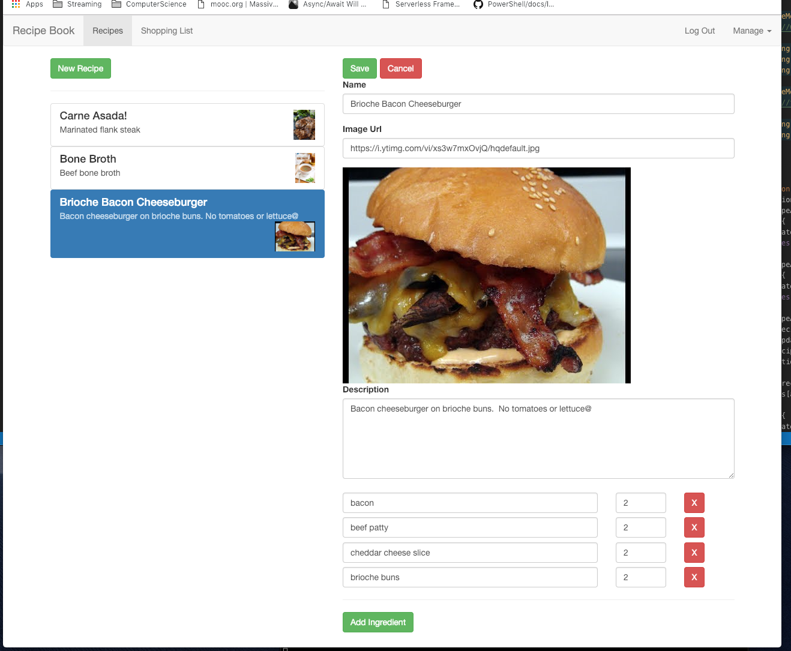
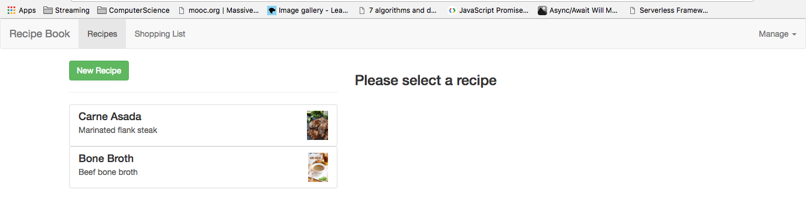

This branch has server side rendering.

# RecipesApp

## About

I'm taking Max Schwarzmueller's course on Angular 7, even though I've been using Angular 5 and 6 in production. It wouldn't hurt to see what other devs are doing with the framework. I'm a little bit more precise and explicit in my naming conventions than Max though, and I will be adding some stuff that wasn't in the course. This app uses FireBase no-sql database and is deployed to AWS.

App residing on AWS here:
http://huy-angular-recipe-book-deployment.s3-website.us-east-2.amazonaws.com/shopping-list
